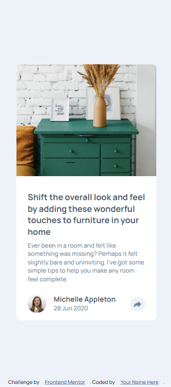

# Frontend Mentor - Article preview component solution

This is a solution to the [Article preview component challenge on Frontend Mentor](https://www.frontendmentor.io/challenges/article-preview-component-dYBN_pYFT). Frontend Mentor challenges help you improve your coding skills by building realistic projects. 

## Table of contents

- [Overview](#overview)
  - [The challenge](#the-challenge)
  - [Screenshot](#screenshot)
  - [Links](#links)
- [My process](#my-process)
  - [Built with](#built-with)
  - [What I learned](#what-i-learned)
  - [Continued development](#continued-development)
  - [Useful resources](#useful-resources)
- [Author](#author)
- [Acknowledgments](#acknowledgments)

**Note: Delete this note and update the table of contents based on what sections you keep.**

## Overview

### The challenge

Users should be able to:

- View the optimal layout for the component depending on their device's screen size
- See the social media share links when they click the share icon

### Screenshot

 


### Links

- Solution URL: [Solution URL here](https://github.com/Emmyk-17/Article-preview)
- Live Site URL: [Live site URL here]( https://emmyk-17.github.io/Article-preview/)

## My process

### Built with

- Semantic HTML5 markup
- Flexbox
- Mobile-first workflow

### What I learned

Use this section to recap over some of your major learnings while working through this project. Writing these out and providing code samples of areas you want to highlight is a great way to reinforce your own knowledge.

To see how you can add code snippets, see below:

```js
shareBtn.addEventListener ("click" , () => {
    SocialBox.classList.toggle("hidden");
})
```

If you want more help with writing markdown, we'd recommend checking out [The Markdown Guide](https://www.markdownguide.org/) to learn more.


### Useful resources

- [Example resource 1](https://www.Youtube.com) - This helped me for JS and some styling. I really recommend this pattern and will use it going forward.


## Author

- Website - [Emmanuel](https://github.com/Emmyk-17)
- Frontend Mentor - [@Emmyk-17](https://www.frontendmentor.io/profile/Emmyk-17)

